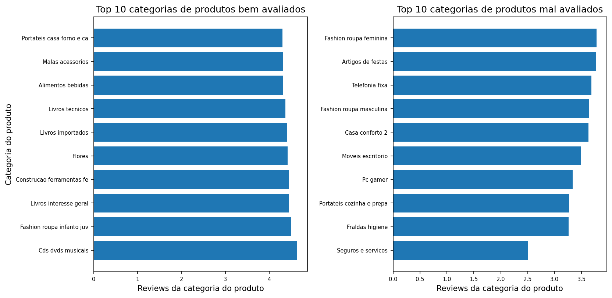
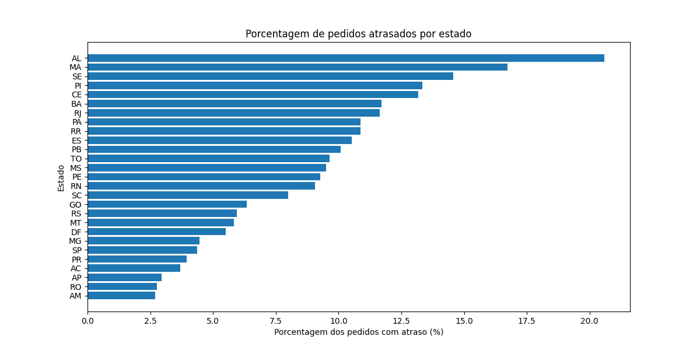
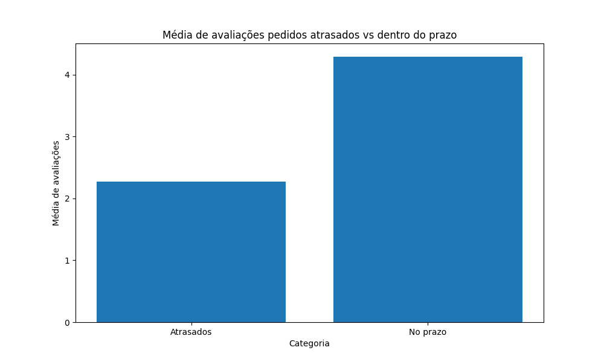
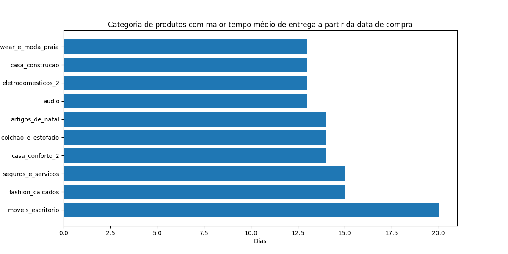
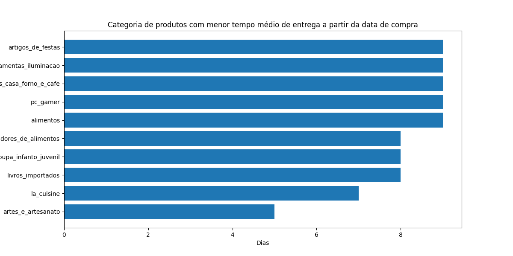
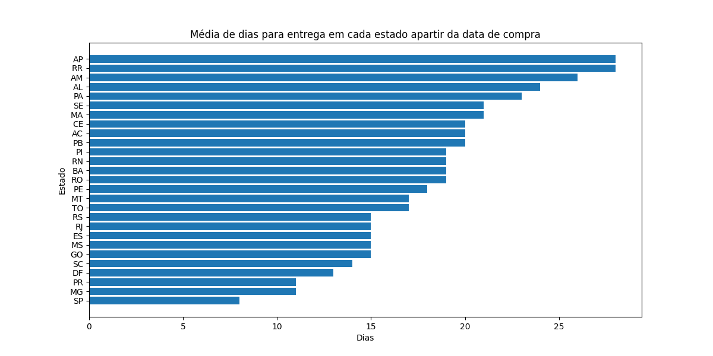
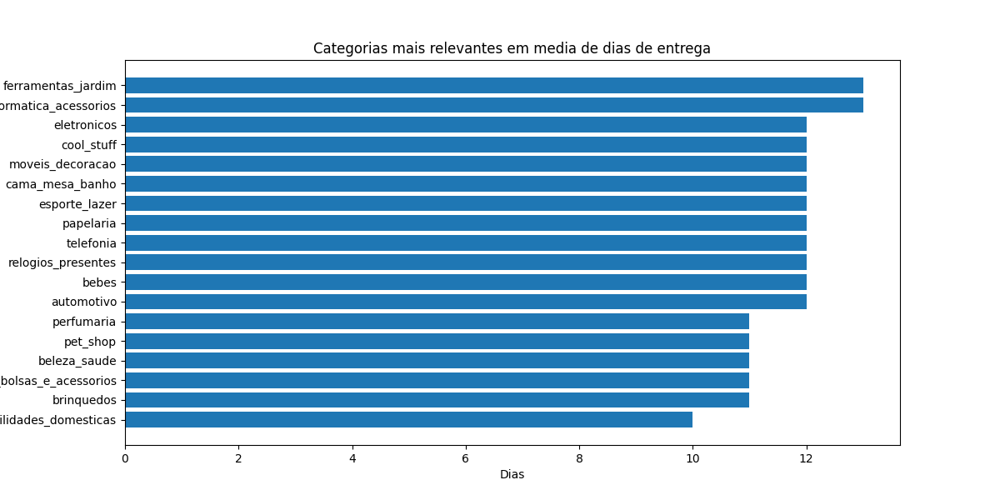

# Análise de E-commerce Brasileiro — Olist

## 📋 Descrição
Este projeto analisou dados públicos sobre o e-commerce brasileiro 
no período de 2016 a 2019, coletados e disponibilizados pela Olist. Através dele foi possível 
observar:
- Porcentagem de pedidos atrasados por estado
- Relação entre atrasos e avaliações dos clientes
- Top 10 categorias mais e menos bem avaliadas
- Tempo médio de entrega por estado
- Tempo médio de entrega por categoria *(filtrado pelo percentil 75 de volume)*
- Categorias com maior volume de vendas e seu prazo médio de entrega

## 🛠️ Tecnologias utilizadas
- Python
- Pandas
- NumPy
- Matplotlib
- Seaborn
- Power BI

## 📊 Resultados

## 🗂️ Fonte dos dados
[Brazilian E-Commerce Public Dataset by Olist — Kaggle](https://www.kaggle.com/datasets/olistbr/brazilian-ecommerce)